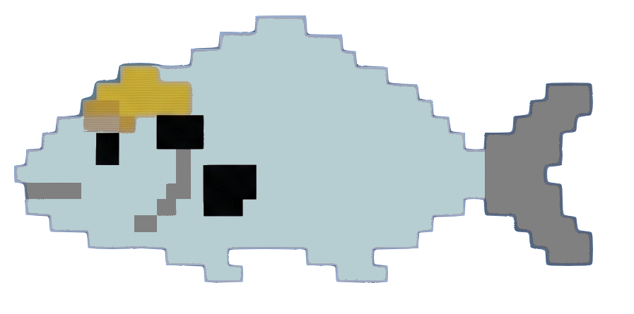

# 📚 Qalibre

<p align="center">
  
</p>

<p align="center">
  <strong>A high-performance document database manager built for AI dataset preparation and library curation.</strong>
</p>

<p align="center">
  <a href="https://github.com/mamorett"></a>
  
  
</p>

---

## 🎯 Purpose & Goals

The primary goal of Qalibre is to act as a **dataset preparation pipeline** for document-based machine learning models (like LLMs, text extraction, and RAG pipelines). It allows researchers, data engineers, and developers to:

*   **Filter & Catalog:** Query, clean, and organize large document libraries.
*   **Metadata Curation:** Clean, tag, edit, and export schema-compliant metadata.
*   **Format Standardization:** Manage conversion formats (EPUB, PDF, HTML, etc.) suitable for downstream text extractors.
*   **Data Hygiene:** Apply flexible allowed lists, blocklists, and custom column criteria to filter raw library assets into clean training datasets.

---

## ✨ Features

*   **⚡ High Performance:** Rebuilt with a Go backend for high-throughput queries and sub-millisecond database lookups.
*   **🎨 Premium UI:** Responsive Single Page Application (SPA) frontend styled using Palantir Blueprint v6 with modern dark-mode aesthetics.
*   **📊 Dataset Curation:** Build custom document datasets for AI model training. Edit EAV metadata entries (keys, values, and types including strings, numbers, timestamps, paths) and manage books using a customizable pagination modal (5, 10, 20, 50, or 100 entries).
*   **📝 Markdown Exporter:** Export complete datasets to structured Markdown directories. Powered by **PyMuPDF (`pymupdf4llm`)**, books (PDF, EPUB, and HTML) are converted to high-fidelity Markdown (supporting multi-column layouts and structured tables) with YAML front-matter metadata, accompanied by a central `dataset.md` index file.
*   **⚡ Idempotent Pipeline:** Subsequent exports are extremely fast, skipping already-converted book files to allow incremental dataset additions.
*   **🔄 Background Task Queue:** Triggers exports asynchronously. Shows real-time progress bars, step-by-step processing messages, and lets you cancel tasks directly from the UI.
*   **📁 Upload Pipeline:** Drag-and-drop file upload with automated metadata parsing (OPF/container mapping) for `.epub` and `.pdf` files.
*   **🔒 Security First:** Role-based permissions (Admin, Upload, Download, Viewer), secure session cookies, and Werkzeug-compatible password verifications.
*   **📖 In-Browser Reader:** Native inline PDF/EPUB reading with support for HTTP Byte Range requests.

---

## 📦 System Dependencies

To run Qalibre from source or enable native document conversions, the following system utilities are required:

| Dependency | Purpose | Installation (Ubuntu/Debian) | Installation (macOS) | Installation (Alpine) |
| :--- | :--- | :--- | :--- | :--- |
| **`uv`** (or **`pymupdf4llm`**) | Markdown conversion engine (PDF, EPUB, HTML) | `curl -LsSf https://astral.sh/uv/install.sh | sh` or `pip install pymupdf4llm` | `brew install uv` or `pip install pymupdf4llm` | `apk add uv` (edge) or copy from docker image |
| **`imagemagick`** | Cover page thumbnail generation | `sudo apt install imagemagick` | `brew install imagemagick` | `apk add imagemagick` |
| **`p7zip`** | comic book archive parsing | `sudo apt install p7zip-full` | `brew install p7zip` | `apk add p7zip` |

---

## 🏗️ Gödel Build System

This project uses **[Palantir gödel](https://github.com/palantir/godel)** via the [godelw](file:///gorgon/dev/qalibre/godelw) wrapper script as its build tool. Gödel manages formatting, static analysis, testing, cross-compilation, and distribution.

### Quick build commands

All commands are run using the [godelw](file:///gorgon/dev/qalibre/godelw) script:

```bash
# Format all Go files
./godelw format

# Run static analysis (compiles, govet, errcheck, etc.)
./godelw check

# Run all tests
./godelw test

# Full verification (format + check + test)
./godelw verify

# Build executables for all configured target platforms
./godelw build

# Build executable only for a specific target platform (e.g. linux-amd64)
./godelw build --os-arch linux-amd64

# Create distribution archives for all platforms
./godelw dist
```

### Target platforms

The `qalibre` product is configured for cross-compilation under [godel/config/dist-plugin.yml](file:///gorgon/dev/qalibre/godel/config/dist-plugin.yml) for the following platforms:

| OS | Arch | Output (via `./godelw dist`) |
| --- | --- | --- |
| Linux | `amd64` | `qalibre-linux-amd64.tar.gz` |
| Linux | `arm64` | `qalibre-linux-arm64.tar.gz` |
| macOS | `arm64` | `qalibre-darwin-arm64.tar.gz` |
| Windows | `amd64` | `qalibre-windows-amd64.zip` |
| Windows | `arm64` | `qalibre-windows-arm64.zip` |

Build artifacts are placed in `out/build/` and can be inspected with `./godelw build` or bundled into release-ready archives in `out/dist/` with `./godelw dist`.

---

## 🚀 Getting Started

### Running with Docker (Recommended)

To run Qalibre instantly in a self-contained container with all dependencies pre-installed using the [Dockerfile](file:///gorgon/dev/qalibre/Dockerfile):

1.  **Build the Image**:
    ```bash
    docker build -t qalibre .
    ```

2.  **Run the Container**:
    ```bash
    docker run -d \
      -p 8083:8083 \
      --name qalibre \
      -v /path/to/calibre/library:/library \
      -v /path/to/persistent/config:/data \
      qalibre
    ```

> [!IMPORTANT]
> *   `/library` must point to your Calibre library containing `metadata.db` and the corresponding book folders.
> *   `/data` is where settings, user sessions, and datasets (`app.db`) are persisted. This ensures your datasets survive container updates.
> *   **UI Export Path**: When exporting a dataset in the frontend, input `/data/my-export` (or any sub-folder of `/data`) to write the resulting files directly to your persistent host storage.

---

### Building from Source

#### 0. Install Python & PyMuPDF4LLM (Local Development)
Ensure you have **Python 3.10+** and either **uv** or **pymupdf4llm** CLI installed and available in your `PATH`.

Using `uv` (recommended):
```bash
# Verify uv is installed
uv --version
```
Qalibre will automatically run pymupdf4llm via `uvx` if not installed globally.

Or install pymupdf4llm directly:
```bash
pip install pymupdf4llm
# Or via pipx
pipx install pymupdf4llm
```

#### 1. Compile the React Frontend SPA
Ensure you have **Node.js 20+** installed:
```bash
cd frontend
npm ci
npm run build
cd ..
```

#### 2. Compile and Launch the Go Server
Ensure you have **Go 1.22+** installed. [godelw](file:///gorgon/dev/qalibre/godelw) handles the Go build:

```bash
# Verify everything (format + check + test)
./godelw verify

# Build for all target platforms (cross-compilation)
./godelw build

# Run the Linux binary directly (after building for all platforms)
./out/build/qalibre/unspecified/linux-amd64/qalibre
```

For a quick single-platform build (local development):
```bash
# Build only for a specific platform (e.g., linux-amd64 or darwin-arm64)
./godelw build --os-arch linux-amd64

# Or build only for the host platform using the standard Go compiler:
CGO_ENABLED=0 go build -o qalibre ./cmd/qalibre
```

---

## ⚙️ Configuration

1.  **Sign In:** Access `http://localhost:8083` and sign in using the default administrator credentials:
    *   **Username:** `admin`
    *   **Password:** `admin123`
2.  **Configure Database:** Navigate to Settings and input the absolute folder path to your Calibre library (e.g. `/library` if mounted in Docker).
3.  **Library Portability:** Qalibre is fully compatible with Calibre's native schema — you can read and write directly to your database with zero migrations.

---

## 👨‍💻 Author & Attribution

Developed and ported to Go by [@mamorett](https://github.com/mamorett).

*Qalibre is inspired by Calibre-Web, but it's a completely new codebase written in Go and TypeScript. It's licensed under the MIT License.*
